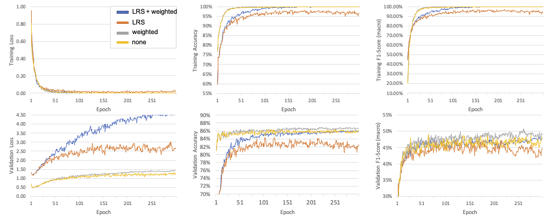

# A Public Repository to Improve Replicability, Comparability and Collaboration in Deep Learning for HAR (PerCom 2022 WiP Submission)

This is the official GitHub page of the workshop paper publication _"Increasing Replicability, Comparability and Collaboration in HAR Through a Common Code Base"_ presented at the 2022 IEEE International Conference on Pervasive Computing and Communications (PerCom 22') Work in Progress (WiP) Session. [[cite our work]](#cite)

**Important:** Please do not forget to cite the papers corresponding to the datasets and architectures featured in this repository if you used to obtain results.

## Abstract
Deep learning methods have become an almost default choice of machine learning approach for human activity recognition (HAR) systems that operate on time series data, such as those of wearable sensors. However, the implementations of such methods suffer from complex package dependencies, obsolescence, and subtleties in the implementation which are sometimes not well documented. 

In order to accelerate research and minimise any discrepancies between (re-)implementations, we introduce a curated, open-source repository which (1) contains complete data loading and preprocessing pipelines for 6 well-established HAR datasets, (2) supports several popular HAR deep learning architectures, and (3) provides necessary functionalities to train and evaluate said models. 

We welcome contributions from the fellow researcher to this repository, made available through: https://github.com/STRCSussex-UbiCompSiegen/dl_har_public

## Contributing to this repository

If you want to contribute to this repository **make sure to fork and clone this repository with all its submodules**. To do so please run:

```
git clone --recurse-submodules -j8 git@github.com:STRCSussex-UbiCompSiegen/dl_har_public.git
```
If you want to have your modification be merged into the repository, please issue a **pull request**. If you don't know how to do so, please check out [this guide](https://jarv.is/notes/how-to-pull-request-fork-github/).

## Repository structure

The repository is structured into one main [public](https://github.com/STRCSussex-UbiCompSiegen/dl_har_public) repository (this one) and three submodules:
- [dataloader](https://github.com/STRCSussex-UbiCompSiegen/dl_har_dataloader/tree/86abd517579a5e4ac87535f4b4b2377e1394188f)
- [model](https://github.com/STRCSussex-UbiCompSiegen/dl_har_model/tree/5e8341ab3c9d0a21a41ec276fd7bc30efed27ff8)
- [analysis](https://github.com/STRCSussex-UbiCompSiegen/dl_for_har_analysis)

More information on each submodule can be found in the ```ReadMe``` of the respective submodule.

### Work in Progress
All logs files, results and plots associated with the experiments mentioned in the _Work in Progress_ section of the publication can be found in the `work_in_progress` excel sheet. 

To rerun the experiments run:

- Setting 1: LRS + weighted

```python main.py -d opportunity -v split --logging```

- Setting 2: LRS

```python main.py -d opportunity -v split --unweighted --logging```

- Setting 3: weighted

```python main.py -d opportunity -v split -lss 0 --logging```

- Setting 4: none

```python main.py -d opportunity -v split -lss 0 --unweighted --logging```

<p align="center">
    
</p>

## (Re)-running experiments
To demonstrate how to commence experiments, we created a sample main script called ```main.py``` within this directory. It shows how to use the main functionalities this repository provides. The script requires to be passed only the ```-d``` (dataset) argument. Currently we support the dataset options: ```opportunity``` [[4]](#4), ```rwhar``` [[6]](#6), ```skoda``` [[8]](#8), ```pamap2``` [[9]](#9), ```hhar``` [[5]](#5) and ```shl``` [[7]](#7).

Using the ```-v``` argument one can define to either run ```loso``` (Leave-One-Subject-Out) or ```split``` (Train-Valid-Test) (cross-)validation. Note that you need to have previously run the corresponding preprocessing for the dataset. More on this can be read up within the ```dataloader``` submodule.

### Setup

Install the required packages using: 

```pip install -r requirements.txt```

Experiments mentioned in the paper were obtained using Python version `3.10`.

### Preprocessing

In order to run any experiments the datasets need to be downloaded locally on your working machine. To do so, run the ```preprocessing.py``` python script within the ```dataloader``` submodule, specifiying the dataset you want to download by passing the according YAML file via the ```-d``` argument. More on this can be read up within the ```dataloader``` submodule.

### Analysis
The ```main.py``` script automatically performs an analysis on the obtained training, validation and (if applicable) testing results. If wished to rerun this analysis, one needs to run the ```analysis.py``` script passing it the ```-d``` (directory) of the log directory of the corresponding experiment. Note that this requires that you saved the predictions results using the ```--save_results``` flag of the ```main.py``` script.


### Weights and biases integration
In order to use weights and biases for logging results, one first needs to set up a free account on [their website](https://wandb.ai). Once registered run the following code within a python environment of your choice.

```
pip install wandb
wandb login
```

You can switch logging with weights and biases on and off by setting the ```--wandb``` flag when running the main script. Make sure that you define the ```wandb_project``` and ```wandb_entity``` variable according to your settings within weights and biases. How to create and entity and project can be looked up within the [documentation of weights and biases](https://docs.wandb.ai).

## Cite

Coming soon

## References
<a id="1">[1]</a> 
Francisco Javier Ordóñez and Daniel Roggen. 2016. 
Deep Convolutional and LSTM Recurrent Neural Networks for Multimodal Wearable Activity Recognition. 2016.  https://doi.org/10.3390/s16010115

<a id="2">[2]</a> 
Marius Bock, Alexander Hölzemann, Michael Moeller, and Kristof Van Laerhoven. 2021. Improving Deep Learning for HAR with Shallow LSTMs,” in
International Symposium on Wearable Computers. https://doi.org/10.1145/3460421.3480419

<a id="3">[3]</a> 
Alireza Abedin, Mahsa Ehsanpour, Qinfeng Shi, Hamid Rezatofighi, Damith C. Ranasinghe. 2021. Attend and Discriminate: Beyond the State-of-the-Art for
Human Activity Recognition Using Wearable Sensors. https://doi.org/10.1145/3448083

<a id="4">[4]</a> 
Daniel Roggen, Alberto Calatroni, Mirco Rossi, Thomas Holleczek, Kilian Förster,Gerhard Tröster, Paul Lukowicz, David Bannach, Gerald Pirkl, Alois Ferscha, Jakob Doppler, Clemens Holzmann, Marc Kurz, Gerald Holl, Ricardo Chavarriaga, Hesam Sagha, Hamidreza Bayati, Marco Creatura, and José del R. Millàn. 2010. Collecting Complex Activity Datasets in Highly Rich Networked Sensor Environments. https://doi.org/10.1109/INSS.2010.5573462

<a id="5">[5]</a> 
Allan Stisen, Henrik Blunck, Sourav Bhattacharya, Thor S. Prentow, Mikkel B.Kjærgaard, Anind Dey, Tobias Sonne, and Mads M. Jensen. 2015. Smart Devices are Different: Assessing and Mitigating Mobile Sensing Heterogeneities for Activity Recognition. https://doi.org/10.1145/2809695.2809718

<a id="6">[6]</a> 
Timo Sztyler and Heiner Stuckenschmidt. 2016. On-Body Localization of Wearable Devices: An Investigation of Position-Aware Activity Recognition. https://doi.org/10.1109/PERCOM.2016.7456521

<a id="7">[7]</a> 
Hristijan Gjoreski, Mathias Ciliberto, Lin Wang, Francisco Javier Ordóñez, Sami Mekki, Stefan Valentin, and Daniel Roggen. 2018. The University of Sussex-Huawei Locomotion and Transportation Dataset for Multimodal Analytics with Mobile Devices. https://doi.org/10.1109/ACCESS.2018.2858933

<a id="8">[8]</a> 
Piero Zappi, Thomas Stiefmeier, Elisabetta Farella, Daniel Roggen, Luca Benini, Gerhard Troster. 2007. Activity Recognition From On-Body Sensors by Classifier Fusion: Sensor Scalability and Robustness. https://doi.org/10.1109/ISSNIP.2007.4496857

<a id="9">[9]</a> 
Attila Reiss and Didier Stricker. 2012. Introducing a New Benchmarked Dataset for Activity Monitoring. https://doi.org/10.1109/ISWC.2012.13
